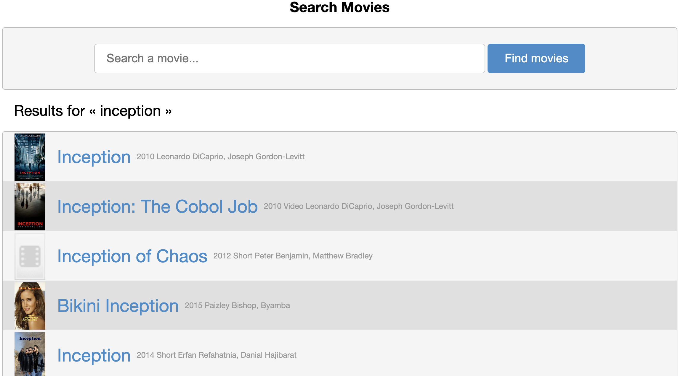

<a id="readme-top"></a>  

# Find Movie Ratings App

[![Contributors][contributors-shield]][contributors-url]
[![Dimitri][linkedin-dimitri-shield]][linkedin-dimitri-url]
[![Barth][linkedin-barthh-shield]][linkedin-barthh-url]

This application is a school project used to learn how to retrieve data from an API, exploit it and make versioning code. We tried to go further by implementing a website UI to make it more accesible for the user.

Note for the teacher : [notes](./NOTE.md) 

<!-- TABLE OF CONTENTS -->
<details open>
  <summary>Table of Contents</summary>
  <ul>
    <li>
      <a href="#about-the-project">About The Project</a>
      <ul>
        <li><a href="#video-presentation">Video presentation</a></li>
        <li><a href="#content">Content</a></li>
        <li><a href="#built-with">Built With</a></li>
      </ul>
    </li>
    <li>
      <a href="#getting-started">Getting Started</a>
      <ul>
        <li><a href="#prerequisites">Prerequisites</a></li>
        <li><a href="#installation">Installation</a></li>
        <li><a href="#run-tests">Run tests</a></li>
      </ul>
    </li>
    <li><a href="#usage">Usage</a></li>
    <li><a href="#future-features">Future features</a></li>
  </ul>
</details>


<!-- ABOUT THE PROJECT -->
## About The Project

This application allows you to find general information (duration, genre, main actors...) about a movie or a serie as well as taking the rating from several website, allowing the user to access it easily as compared to go from one website to the other. 
The data comes from the [IMDb API website](https://imdb-api.com). The project is built with [python 3.9](https://docs.python.org/3.9/) and the [Flask framework](https://flask.palletsprojects.com/en/2.2.x/).


<p align="center" style="width: 100%; display: flex; justify-content: space-between;">
  
   
</p>

### Video presentation

_Here is a video to explain better the app : [link](https://www.youtube.com/watch?v=T_LxS2t20UI)_

<p align="center" style="width: 100%;">
  <a href="https://www.youtube.com/watch?v=T_LxS2t20UI">
    
  </a>
</p>

### Content

Usefull content table :

| Template name | Description |
| ------------- | ----------- |
| [App folder](./app/) | The website application |
| [Package folder](./package/) | Packages to retrieve the data from IMDb API |
| [Tests folder](./tests/) | Various tests |
| [app.py](./app.py) |  The file used to launch the app |

### Built With

* [![Python][Python]][Python-url]
* [![Flask][Flask]][Flask-url]

<p align="right">(<a href="#readme-top">back to top</a>)</p>


<!-- GETTING STARTED -->
## Getting Started

### Prerequisites

You need [python 3.9](https://docs.python.org/3.9/) to run this project.

### Installation

_Below are the instructions_

1. Clone the repository :
    ```
    https://github.com/barthh/api-imdb.git
    cd api-imdb
    ```
1. Navigate over to [IMDb's API website](https://imdb-api.com), sign up and go to the profile section to get a API token.
  
1. Create an ```.env``` file and put your API token in a as follows :
    ```sh
    export API_token=thisismyAPItoken
    ```
2. Create a virtual environment :
    ```python
    pipenv install
    ```
    > If you are missing the module, install it according to your system : [Get commands](https://pypi.org/project/pipenv/#installation)
1. Run the app :
    ```python
    pipenv run python3 app.py
    ```
1. Navigate to http://127.0.0.1:5000/ in your browser

### Run tests

A test on your API Key is done when you start the application.

To test manually the package you can do as follow:
```python
pipenv run pytest
```

NB : There are no tests for the app at this time.

<p align="right">(<a href="#readme-top">back to top</a>)</p>


<!-- USAGE EXAMPLES -->
## Usage

You can search for a movie or a series using the search bar in the home menu.
You will be redirected to a list of movies/series that best matches your search.
Select the one from which you require more information.
You will be taken to a page that contains information about the selected movie/series.
In the navigation bar you can go back to the main menu or use the movie/series search.

Here are some additional features:

- If the user goes to a link not found (wrong path), a 404 error is displayed. 
- If the user's API key has reached its daily limit (100 uses) or is wrong, an error is displayed.
- If no movie/series was found, the user will be notified.
- If the movie/series has no information, the user will be notified.
- If the movie/series does not have a cover image, a template image is displayed


<p align="right">(<a href="#readme-top">back to top</a>)</p>

## Future features

_Here are the possible improvements_

- Add tests for the app
- Add a makefile to launch easily the project
- Have only one search bar in the menu with a drop-down bar to choose the type of search
  
Integrate new features into the package :
- Find the most relevant keywords of a search. (Suggests words when the user is doing a search)
- Possibility to search for an actor/writer/director.
- Get information related to an actor/writer/director
- Add a top of titles by year, genre, type...

Integrate the application features already available in the package :
- Do a general search that provides titles (movies, series,...), people (writers, actors,...) and similar words to the search
- Below the film or series information, suggest similar titles

<p align="right">(<a href="#readme-top">back to top</a>)</p>

<!-- MARKDOWN LINKS & IMAGES -->

<!-- Introduction -->

[contributors-shield]: https://img.shields.io/github/contributors/barthh/api-imdb.svg?style=for-the-badge
[contributors-url]: https://github.com/barthh/api-imdb/graphs/contributors

[linkedin-dimitri-shield]: https://img.shields.io/badge/-Dimitri-black.svg?style=for-the-badge&logo=linkedin&colorB=555
[linkedin-dimitri-url]: https://www.linkedin.com/in/dimitri-prieur/

[linkedin-barthh-shield]: https://img.shields.io/badge/-Barthelemy-black.svg?style=for-the-badge&logo=linkedin&colorB=555
[linkedin-barthh-url]: https://www.linkedin.com/in/barthh/

<!-- Build with -->
[Flask]:https://img.shields.io/badge/Flask-000000?style=for-the-badge&logo=Flask&logoColor=ffffff
[Flask-url]:https://flask.palletsprojects.com/en/2.2.x/

[Python]: https://img.shields.io/badge/Python-3776AB?style=for-the-badge&logo=Python&logoColor=FFD43B
[Python-url]: https://www.python.org/